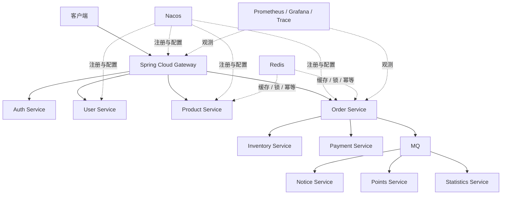

# Java 后端微服务学习计划

## 适用对象

面向已经具备 Spring Boot、MySQL、Redis、消息队列等基础，希望系统掌握 Spring Cloud 微服务开发、治理和部署能力的 Java 后端开发者。

本计划不按周数或完成时长安排，而是按照技术依赖关系和学习优先级排序。完成前一项的“通过标准”后，再进入下一项。

## 一、学习目标

最终目标不是背诵 Nacos、Gateway、Seata 等组件，而是能够：

- 独立设计一套合理的微服务架构。
- 解释单体拆分后产生的调用、配置、认证、容错、一致性和运维问题。
- 使用 Spring Cloud 组件解决真实业务问题。
- 主动制造故障并分析系统的保护、降级、重试或补偿路径。
- 使用 Docker、监控和链路追踪交付一套可运行、可观察的系统。
- 将项目沉淀为 GitHub 项目、README 和技术文章。

学习过程中始终围绕一个问题：

> 单体架构拆成多个服务以后产生了什么问题，Spring Cloud 又是如何解决这些问题的？

## 二、学习顺序总览

| 优先级 | 学习主题 | 主要目标 |
| --- | --- | --- |
| 1 | 微服务思想与整体架构 | 理解为什么拆、如何拆，以及拆分后增加的复杂度 |
| 2 | Nacos：注册中心与配置中心 | 解决服务发现、统一配置和动态刷新问题 |
| 3 | OpenFeign：服务间远程调用 | 建立清晰的服务调用、DTO 和异常边界 |
| 4 | LoadBalancer：负载均衡 | 完成实例选择、多实例分流和基础调用稳定性 |
| 5 | Gateway：统一入口与路由治理 | 统一处理路由、过滤、跨域和入口治理 |
| 6 | JWT：微服务统一认证 | 解决登录后的身份传递和下游授权问题 |
| 7 | Sentinel：限流、熔断与降级 | 应对慢调用、服务不可用和雪崩风险 |
| 8 | Seata：分布式事务与一致性 | 理解跨服务事务边界、回滚和补偿机制 |
| 9 | Redis：缓存、锁与幂等 | 处理热点数据、并发控制和重复请求 |
| 10 | MQ：异步解耦与最终一致性 | 处理削峰、重试、死信、重复消费和异步业务 |
| 11 | 可观测性：日志、指标与链路 | 快速定位跨服务调用中的延迟和故障 |
| 12 | Docker：可复现部署与交付 | 让基础设施和服务能够统一启动、复现和交付 |

## 三、统一学习方法

每个技术点都按照下面的循环推进：

1. 先说明单体情况下通常如何实现。
2. 再指出拆成微服务以后出现的新问题。
3. 明确当前组件解决的具体问题、适用边界和代价。
4. 完成一个最小可运行 Demo。
5. 主动制造异常、慢调用、重复消费或数据失败。
6. 分析底层原理、关键配置和故障表现。
7. 总结常见面试问题。
8. 集成到 CloudMall 主线项目，并补充 README。

不要把“视频看完了”作为完成标准。更可靠的标准是：能解释为什么需要它，能写出最小 Demo，能主动触发一次故障，能说清恢复或降级路径，并能把它接进主线项目。

## 四、按优先级展开

### 优先级 1：微服务思想与整体架构

#### 重点解决的问题

- 为什么要从单体拆成多个服务？
- 拆分后增加了哪些独立部署、远程调用、数据一致性、故障传播和运维成本？
- 服务边界应该按照什么原则划分？

#### 学习重点

- 单体架构与微服务架构的优缺点。
- 服务边界、独立部署和独立数据库。
- 同步调用与异步调用。
- 服务治理的整体地图。

#### 实践落点

创建一个 Maven 多模块项目：

```text
spring-cloud-demo
├── common
├── user-service
├── product-service
└── order-service
```

让三个业务服务能够独立启动，并画出客户端、网关、服务、Nacos、MySQL、Redis 和 MQ 的关系。

详细学习材料：[1、微服务思想与整体架构](1、微服务思想与整体架构.md)

#### 通过标准

能够用自己的话讲清一次请求如何穿过多个服务，以及每增加一个服务会增加什么复杂度。

### 优先级 2：Nacos - 注册中心与配置中心

#### 重点解决的问题

服务数量增加以后，服务如何知道彼此的地址？配置分散在各服务本地时，如何统一管理和动态调整？

#### 学习重点

- 服务注册与服务发现。
- Namespace、Group、Instance。
- 健康检查。
- 临时实例与持久实例。
- 配置中心和动态刷新。
- Nacos 为什么既能做注册中心，又能做配置中心。

#### 实践落点

- 让 `user-service`、`product-service`、`order-service` 完成注册。
- 通过服务名发现实例。
- 把订单服务配置放入 Nacos。
- 修改配置并验证服务能够获取新配置。

详细学习材料：[2、Nacos注册中心与配置中心](2、Nacos注册中心与配置中心.md)

#### 通过标准

能够查看实例状态，区分 Namespace 和 Group 的作用，解释配置加载与动态刷新链路，并能处理服务下线或健康检查失败。

### 优先级 3：OpenFeign - 服务间远程调用

#### 重点解决的问题

订单服务如何查询用户和商品？远程调用失败、超时或返回结构变化时，调用方和被调用方如何保持边界清晰？

#### 学习重点

- 声明式 HTTP 调用。
- 服务发现与接口契约。
- DTO 边界设计。
- 超时、重试和异常处理。
- Feign 与 RestTemplate / WebClient 的关系。

#### 实践落点

让 `order-service` 通过 Feign 调用 `user-service` 和 `product-service`。服务之间使用 DTO 交互，不直接复用对方的数据库实体，并统一处理远程调用失败和空数据。

```java
@FeignClient(name = "user-service")
public interface UserClient {

    @GetMapping("/users/{id}")
    UserDTO getUser(@PathVariable Long id);
}
```

详细学习材料：[3、OpenFeign服务间远程调用](3、OpenFeign服务间远程调用.md)

#### 通过标准

能够解释 `@FeignClient` 从服务名到 HTTP 请求的完整链路，并能在下游服务不可用时返回可理解的业务错误。

### 优先级 4：LoadBalancer - 实例选择与调用稳定性

#### 重点解决的问题

服务发现只解决了“有哪些实例”，真正发请求时如何选择实例并分散流量？多个实例之间如何验证调用确实发生了分流？

#### 学习重点

- Spring Cloud LoadBalancer 的基本机制。
- 实例列表和负载均衡策略。
- 多实例下的调用表现。
- 超时与重试边界。
- 写请求重复重试的风险。

#### 实践落点

启动两个 `product-service` 实例，为实例设置可识别标记，让订单服务连续调用并观察请求分布。停止其中一个实例，验证健康实例接管请求。

详细学习材料：[4、LoadBalancer实例选择与调用稳定性](4、LoadBalancer实例选择与调用稳定性.md)

#### 通过标准

能够区分服务发现与负载均衡，解释实例选择发生在哪一层，并能说明重试如何放大流量或造成重复写入。

### 优先级 5：Gateway - 统一入口与路由治理

#### 重点解决的问题

客户端如果直接访问每个服务，会暴露多少内部地址和规则？跨域、路由和公共过滤逻辑应该放在哪里？

#### 学习重点

- Route、Predicate、Filter、GlobalFilter。
- 路由转发。
- 动态路由。
- CORS。
- Gateway 与 Nacos 的整合。
- 网关作为系统边界的职责。

#### 实践落点

实现统一路由：

```text
/api/users/**     → Gateway → user-service
/api/orders/**    → Gateway → order-service
/api/products/**  → Gateway → product-service
```

将公共日志、请求头处理和基础鉴权前置到网关，但不要把核心业务逻辑堆进网关。

详细学习材料：[5、Gateway统一入口与路由治理](5、Gateway统一入口与路由治理.md)

#### 通过标准

能够从请求路径追踪到目标服务，解释过滤器执行顺序，并能区分网关职责与下游服务职责。

### 优先级 6：JWT - 微服务统一认证

#### 重点解决的问题

用户登录后，多个下游服务如何知道当前用户是谁？为什么不能无条件相信客户端自己传进来的用户 Header？

#### 学习重点

- 登录与 Token 签发。
- JWT 校验。
- 网关统一认证。
- 提取 `userId` 并向下游传递用户上下文。
- 认证与授权的区别。
- Header 信任边界。

#### 实践落点

实现以下链路：

```text
用户登录
  ↓
获取 JWT
  ↓
请求 Gateway
  ↓
校验 Token
  ↓
提取 userId
  ↓
传递可信用户上下文
  ↓
下游服务进行业务授权
```

下游服务只使用网关生成或校验后的上下文，不直接信任外部 Header。

详细学习材料：[6、JWT微服务统一认证](6、JWT微服务统一认证.md)

#### 通过标准

能够讲清 JWT、网关认证、Header 传递和下游获取用户上下文的链路，并能区分认证和授权。

### 优先级 7：Sentinel - 限流、熔断与降级

#### 重点解决的问题

当库存服务变慢或不可用时，为什么订单服务会被拖垮，最终形成雪崩？

#### 学习重点

- 限流。
- 熔断。
- 降级。
- 热点参数。
- 系统保护。
- Feign 整合。
- 熔断器状态机：`CLOSED → OPEN → HALF_OPEN → CLOSED`。

#### 实践落点

人为让 `product-service` 延迟数秒，持续制造大量调用，观察调用方线程、超时、熔断和降级结果。不要只在 Dashboard 点规则，要验证规则对业务结果的影响。

详细学习材料：[7、Sentinel限流熔断与降级](7、Sentinel限流熔断与降级.md)

#### 通过标准

能够解释限流与熔断的区别，复现一次服务雪崩风险，描述状态机转移和用户最终看到的降级结果。

### 优先级 8：Seata - 分布式事务与一致性

#### 重点解决的问题

订单、库存和账户分属不同服务、不同数据库时，为什么一个 `@Transactional` 已经不够？

#### 学习重点

- 本地事务与分布式事务。
- CAP、BASE 和最终一致性。
- Seata 的 AT、TCC、Saga、XA。
- TC、TM、RM 的协作。
- AT 模式的分支事务与回滚信息。
- 超时、重试和人工补偿。

#### 实践落点

实现以下业务链：

```text
创建订单
  ↓
扣库存
  ↓
扣余额
  ↓
写入订单记录
```

主动制造“扣库存成功、扣余额成功、创建订单失败”的异常，观察回滚或补偿路径，并记录不同事务模式的适用边界。

详细学习材料：[8、Seata分布式事务与一致性](8、Seata分布式事务与一致性.md)

#### 通过标准

能够解释本地事务的边界，说明 Seata AT 如何依赖分支事务和回滚日志恢复数据，并能判断哪些场景更适合 TCC、Saga 或最终一致性。

### 优先级 9：Redis - 缓存、锁与幂等

#### 重点解决的问题

微服务调用链和热点数据增加后，如何降低数据库压力、控制并发，并防止重复提交造成重复扣库存或重复下单？

#### 学习重点

- 缓存。
- 分布式锁。
- 幂等。
- Session / Token。
- 限流辅助。
- Key 设计和过期策略。
- 缓存击穿、穿透、雪崩和数据不一致。
- Redisson。

#### 实践落点

- 为商品详情、库存校验或热点配置增加缓存。
- 为关键写操作设计幂等键。
- 在必要场景使用 Redisson 实现分布式锁。
- 验证锁超时、续期和异常释放。

详细学习材料：[9、Redis缓存锁与幂等](9、Redis缓存锁与幂等.md)

#### 通过标准

能够说明缓存问题的成因和处理方式，能用请求幂等避免重复消费，并能解释分布式锁不是事务的替代品。

### 优先级 10：MQ - 异步解耦与最终一致性

#### 重点解决的问题

哪些工作不需要同步阻塞用户请求？消息重复、消费失败、积压和顺序问题出现时，系统如何保持可恢复？

#### 学习重点

- 服务解耦。
- 异步处理。
- 削峰。
- 重试。
- 死信队列。
- 重复消费。
- 消息幂等。
- 消息可靠投递。
- 最终一致性。

RabbitMQ 和 RocketMQ 选择一个深入即可，不建议同时铺开。

#### 实践落点：订单超时自动取消

```text
创建订单
  ↓
发送延迟消息
  ↓
消费者检查订单状态
  ↓
仍未支付
  ↓
取消订单
  ↓
恢复库存
```

补充失败重试、死信和重复消费保护。

详细学习材料：[10、MQ异步解耦与最终一致性](10、MQ异步解耦与最终一致性.md)

#### 通过标准

能够解释同步调用与消息驱动的取舍，处理重复消息和消费失败，并把订单状态、库存状态和消息状态串成可追踪的业务流程。

### 优先级 11：可观测性 - 日志、指标与链路追踪

#### 重点解决的问题

用户说“下单接口用了 5 秒”时，如何判断慢在网关、订单服务、商品服务、Redis 还是 MySQL？

#### 学习重点

- Actuator。
- Micrometer。
- Prometheus。
- Grafana。
- 结构化日志。
- TraceId。
- 分布式链路追踪。

#### 实践落点

为 Gateway、订单、商品、库存和基础设施接入健康检查、关键指标、TraceId 和统一日志。构造一次慢调用，沿链路找出耗时来源。

详细学习材料：[11、可观测性日志指标与链路追踪](11、可观测性日志指标与链路追踪.md)

#### 通过标准

能用日志、指标和链路三类证据定位问题，不依赖猜测；能给出接口成功率、延迟、错误率和依赖服务状态的基本观测方案。

### 优先级 12：Docker - 可复现部署与交付

#### 重点解决的问题

开发环境能运行不等于系统可交付。如何让 Nacos、MySQL、Redis、MQ、Sentinel、Gateway 和各个服务用一致方式启动？

#### 学习重点

- 镜像构建。
- 容器网络。
- 环境变量。
- 健康检查。
- 日志。
- 依赖启动顺序。
- Docker Compose。
- Nginx 作为外部入口或静态资源层的使用方式。

#### 实践落点

编写 Compose 配置，一键启动基础设施、Gateway 和各个业务服务；把本地配置外置，验证容器重启、服务发现和健康检查。

```bash
docker compose up -d
```

详细学习材料：[12、Docker可复现部署与交付](12、Docker可复现部署与交付.md)

#### 通过标准

能够用 Compose 启动完整系统，说明容器之间如何通信、配置如何注入、服务异常如何排查，并让别人按 README 复现。

## 五、贯穿全程的 CloudMall 实战主线

### 建议架构



### 服务划分建议

- 基础服务：Auth、User、Product、Order、Inventory、Payment。
- 异步扩展：Notice、Points、Statistics。
- 基础设施：Nacos、MySQL、Redis、Redisson、RabbitMQ 或 RocketMQ、Sentinel、Seata。
- 交付与观测：Gateway、Docker Compose、Nginx、Prometheus、Grafana、统一日志和 TraceId。

### 实战要求

- 每增加一个组件，都先写清它解决的具体问题，再接入项目。
- 每个关键能力至少设计一次可复现的异常实验，例如服务下线、慢调用、消息重复或事务中途失败。
- 服务之间通过接口和 DTO 交互，不直接共享业务数据库。
- README 记录架构图、启动方式、关键配置、故障实验、设计取舍和常见面试问题。
- 最终形成一个可运行、可部署、可观测，并且能够解释关键设计的 GitHub 项目。

## 六、完成后的能力验收清单

- [ ] 能从一次用户请求出发，讲清 Gateway、认证、服务发现、远程调用、数据库、缓存、消息和链路追踪如何协作。
- [ ] 能主动复现服务超时、实例下线、消息重复、跨库失败和容器异常。
- [ ] 能说明每类故障对应的保护、重试、降级或补偿路径。
- [ ] 能说明什么时候使用同步调用，什么时候使用 MQ。
- [ ] 能说明什么时候使用本地事务、Seata 或最终一致性。
- [ ] 能判断哪些场景不应该重试，避免流量放大和重复写入。
- [ ] 别人可以根据 README 启动项目、访问接口、观察服务状态，并复现至少一组关键实验。
- [ ] 每个组件都准备好“为什么需要、解决什么、怎么实现、失败怎么办、边界是什么”五类面试问题。

## 七、最终沉淀

最终要沉淀的不是一组零散的 Spring Cloud Demo，而是一条完整知识链：

```text
单体
 ↓
服务拆分
 ↓
注册与发现
 ↓
远程调用
 ↓
负载均衡
 ↓
网关与认证
 ↓
限流、熔断与降级
 ↓
分布式事务与数据一致性
 ↓
异步解耦与消息一致性
 ↓
可观测性
 ↓
容器化部署
```

这条路线最终应当沉淀为一个完整项目、架构说明、故障实验记录和一系列技术文章，而不是学完之后只剩下一堆零散 Demo。
